# Greentic OAuth Broker

Greentic OAuth stitches together the `greentic-oauth-broker`, SDKs, and worker tooling used by Greentic products to manage delegated access to third-party APIs. The broker performs OAuth handshakes, stores encrypted credentials, and exposes HTTP, NATS, WIT, and SDK contracts so other services can initiate flows, await results, and issue signed requests on behalf of tenants and teams.

> **OAuth Conformance CI Incoming** — automated checks now run `cargo fmt`, `cargo clippy`, `cargo build`, and `cargo test` on every pull request so regressions are caught early.

## Interface bindings

Hosts should import capabilities through the curated bindings crates:
- `greentic-interfaces-host` for host-side interfaces (secrets/state/session/oauth/http/telemetry)
- `greentic-interfaces-wasmtime` for Wasmtime linker helpers

Guest components (wasm32-wasip2) should depend on `greentic-interfaces-guest`. Direct WIT/bindgen usage is being phased out in favour of these crates.

See `docs/bindings-migration.md` for migration notes.

## Toolchain

This workspace targets the Rust 2024 edition. Until the edition stabilises, you need the nightly toolchain:

```bash
rustup toolchain install nightly
```

The included `rust-toolchain.toml` pins CI and local commands to nightly (with `rustfmt` and `clippy` components), so `cargo …` will automatically use the correct compiler once it is installed.

To mirror CI locally, run:

```bash
make check
```

## PKCE & custom OAuth parameters

`greentic-oauth-core` now surfaces the optional PKCE verifier and any
provider-specific parameters collected during initiation. Providers implementing
`Provider::exchange_code` receive a `pkce_verifier: Option<&str>` hint so they
can forward S256 verifiers to upstream token endpoints when required. The
`OAuthFlowRequest` type also exposes an `extra_params` map for whitelisted
authorization or token request tweaks (for example `prompt=select_account` or
`login_hint=user@example.com`). The core crate does not validate these entries;
brokers and SDKs are responsible for enforcing allow-lists appropriate for each
provider. The broker sanitises and allow-lists the keys for each integration
(`prompt`, `login_hint`, etc.) before forwarding them. Set
`BROKER_ALLOW_EXTRA_PARAMS=0` in deployments that must reject all dynamic query
overrides—the handler will log and drop any user-supplied values in that mode.

## Admin provisioning (preview)

Tenant administrators can bootstrap OAuth applications directly from the broker
via the `/admin/providers/*` endpoints or the `greentic-oauth-admin` CLI.
Provisioners advertise their `ProvisionCaps` so callers know whether app
creation, redirect management, secret generation, webhook installation, or
scope grants happen automatically or require a guided hand-off. All writes flow
through greentic-secrets using the standard key layout:

| Scope | Path prefix | Example keys |
| --- | --- | --- |
| Global | `messaging/global/{provider}` | `client_id`, `client_secret`, `app_config.json` |
| Tenant | `messaging/tenant/{tenant}/{provider}` | `refresh_token`, `issuer`, `webhook_secret/foo` |

### Supported providers & capability matrix

| Provider (feature flag) | Mode | Capabilities (app/redirect/secret/webhook/scope) | Live-mode env |
| --- | --- | --- | --- |
| Microsoft Entra ID (`admin-ms`) | Automated | ✅/✅/✅/✅/✅ | `PUBLIC_HOST`, `MS_TENANT_ID`, `MS_CLIENT_ID`, `MS_CLIENT_SECRET` or `MS_CLIENT_CERT_PFX` + `MS_CLIENT_CERT_PASSWORD`, `MS_TEAMS_APP_ID`, `MS_WEBHOOK_NOTIFICATION_URL` |
| Okta (`admin-okta`) | Automated global / guided tenant | ✅/✅/✅/❌/✅ | `OKTA_BASE_URL`, `OKTA_API_TOKEN`, optional per-tenant `OKTA_TENANT_BASE_URL`, `OKTA_TENANT_API_TOKEN` |
| Auth0 (`admin-auth0`) | Automated global / guided tenant | ✅/✅/✅/❌/✅ | `AUTH0_DOMAIN`, `AUTH0_MGMT_CLIENT_ID`, `AUTH0_MGMT_CLIENT_SECRET` |
| Keycloak (`admin-keycloak`) | Automated global / guided tenant | ✅/✅/✅/❌/✅ | `KC_BASE_URL`, `KC_REALM`, `KC_CLIENT_ID`, `KC_CLIENT_SECRET` |
| Google (`admin-google`) | Guided | ❌/❌/❌/❌/❌ | — |
| GitHub (`admin-github`) | Guided | ❌/❌/❌/⚠️/❌ | — |
| Slack (`admin-slack`) | Guided | ❌/❌/❌/✅/❌ | — |

If the required environment variables are missing the provisioner transparently
falls back to mock mode so CI/tests remain hermetic.

### CLI workflow

The admin CLI wraps the HTTP endpoints:

```bash
# List compiled-in provisioners and their capabilities
cargo run -p greentic-oauth-broker --bin greentic-oauth-admin -- providers

# Start an admin authorization flow (automated providers only)
cargo run -p greentic-oauth-broker --bin greentic-oauth-admin -- \
  start --provider msgraph --tenant global

# Apply a desired state document (see examples/desired_app/*.json)
cargo run -p greentic-oauth-broker --bin greentic-oauth-admin -- \
  ensure --provider okta --tenant acme \
  --file examples/desired_app/okta_tenant_guided.json

# Preview changes without writing secrets or patching remote apps
cargo run -p greentic-oauth-broker --bin greentic-oauth-admin -- \
  plan --provider okta --tenant acme \
  --file examples/desired_app/okta_tenant_guided.json
```

`ensure` accepts the JSON payload described by `DesiredAppRequest`. For guided
providers, populate the resulting OAuth credentials under
`desired.extra_params`:

| Provider | Required keys | Optional keys |
| --- | --- | --- |
| Google | `client_id`, `client_secret` | — |
| GitHub | `client_id`, `client_secret` | `webhook_secret` |
| Slack | `client_id`, `client_secret`, `signing_secret` | `bot_token` |
| Okta tenant | `issuer`, `client_id`, `client_secret` | `refresh_token`, `authz_server_id` |
| Auth0 tenant | `issuer`, `client_id`, `client_secret` | `refresh_token`, `audience` |
| Microsoft tenant | use `/admin/messaging/teams` spec; see Teams section below | — |
| Keycloak tenant | `client_id`, `client_secret` | `issuer`, `refresh_token` |

The broker sanitises and stores those values under
`messaging/tenant/{tenant}/{provider}/*`, making them available to the runtime
token handlers without exposing secrets in logs or responses. Audit events fire
for every secret write and resource change, so the operator trail remains
complete even when provisioning happens through the CLI.

**Microsoft Teams tenants**: describe each tenant’s desired state in a spec file
and send it through the dedicated Teams endpoints (or the
`greentic-oauth-admin teams ...` subcommands). The schema matches
[`examples/desired_app/teams_tenant.json`](examples/desired_app/teams_tenant.json):

```json
{
  "tenant_key": "acme",
  "provider_tenant_id": "00000000-0000-0000-0000-000000000000",
  "requested_scopes": ["ChannelMessage.Read.Group"],
  "resources": [
    { "kind": "team", "id": "19:abc@thread.tacv2", "display_name": "Support" },
    { "kind": "channel", "id": "19:abc@thread.tacv2|19:general", "display_name": "General" }
  ],
  "credential_policy": { "ClientSecret": { "rotate_days": 180 } }
}
```

Plan/dry-run the diff:

```
cargo run -p greentic-oauth-broker --bin greentic-oauth-admin -- \
  teams plan --tenant acme \
  --file examples/desired_app/teams_tenant.json
```

Apply it (install app, probe RSC, reconcile subscriptions):

```
cargo run -p greentic-oauth-broker --bin greentic-oauth-admin -- \
  teams ensure --tenant acme \
  --file examples/desired_app/teams_tenant.json
```

The broker stores the normalized resources at
`messaging/tenant/{tenant}/teams/teams.json`, tracks active tenants in
`messaging/global/teams/tenants.json`, and reacts to Microsoft Graph
notifications received at `/ingress/ms/graph/notify/{tenant}`. Set
`MS_WEBHOOK_NOTIFICATION_URL` (or ensure `PUBLIC_HOST` is resolvable) so the
provisioner can register those subscriptions.

The CLI mirrors the REST endpoints:

```
# preview changes with a summary table + JSON payload
greentic-oauth-admin teams plan --tenant acme --file teams.json

# apply the desired state
greentic-oauth-admin teams ensure --tenant acme --file teams.json

# fetch the currently stored spec (for editing)
greentic-oauth-admin teams get-spec --tenant acme

# install or remove a single team without touching other teams
greentic-oauth-admin teams install --tenant acme --team-id 19:team
greentic-oauth-admin teams remove-team --tenant acme --team-id 19:team
```

`teams plan` now prints a quick summary (team action plus channel-level
subscriptions) before dumping the full JSON plan. The REST responses are the
same shape, so runners can consume the structured `TeamsPlanReport` directly.

## Self-describing OAuth

The broker now publishes a discovery surface so agents and digital workers can enumerate providers, inspect tenant-scoped requirements, and kick off flows without out-of-band documentation. Every discovery response is cache-friendly (`ETag`, `Cache-Control: max-age=60`) and, when configured, signed with the broker's discovery key so callers can verify integrity.

Key artifacts:

- `/.well-known/greentic-oauth` – feature manifest (capabilities, JWKS URI, linked indexes)
- `/oauth/discovery/providers` – provider catalog
- `/oauth/discovery/{tenant}/providers/{provider}` – merged descriptor with signature
- `/oauth/discovery/{tenant}/providers/{provider}/requirements` – flow requirements per grant type
- `/oauth/discovery/{tenant}/providers/{provider}/blueprint` – blueprint for the next action in a flow

👉 See [docs/discovery.md](docs/discovery.md) for complete endpoint summaries, curl walkthroughs for Microsoft Graph and Slack, and guidance for MCP/WIT callers.

## Architecture


1. **Client / UI** – requests a flow for a specific tenant/team and redirects the user to the provider consent screen.
2. **OAuth Broker (`crates/greentic-oauth-broker`)** – published as `greentic-oauth-broker`; exposes HTTP + NATS APIs, orchestrates provider flows, signs token handles (JWS), encrypts secrets (JWE), and publishes audit/NATS events.
3. **Secrets Manager** – default `EnvSecretsManager` persists encrypted payloads using keys like `oauth:env:{env}:tenant:{tenant}:team:{team}:owner:{kind}:{id}:provider:{provider}.json`.
4. **Provider integrations** – pluggable providers (Microsoft Graph, Generic OIDC today) registered via env-driven config.
5. **Worker / SDKs** – `oauth-worker` (Cloudflare Worker example) and `greentic-oauth-sdk` (Rust SDK + WIT bindings) consume broker APIs for automation and WASM embedding.

## HTTP API Contract

All endpoints live under the broker root (default `0.0.0.0:8080`). Path segments follow `{env}/{tenant}/{provider}` with optional `team` query parameters.

| Method | Path | Description |
| --- | --- | --- |
| `POST` | `/oauth/start` | JSON body matching the legacy query parameters (`env`, `tenant`, `provider`, `team`, `owner_kind`, `owner_id`, `flow_id`, `scopes`, `visibility`, `redirect_uri`). Creates an `AuthSession` with PKCE + signed state and returns `{ "start_url": "https://broker/authorize/{sid}" }`. |
| `GET` | `/authorize/:id` | Validates the session id, rehydrates the stored authorize URL, and issues a `302` redirect to the external provider. Sessions expire after 15 minutes and are one-time-use. |
| `GET` | `/:env/:tenant/:provider/start` | Legacy flow initiation via query parameters. Still supported for backwards compatibility. |
| `GET` | `/callback` (also `/oauth/callback`) | Provider redirect target. Query: `code`, `state`, optional `error`. Persists encrypted token, publishes `oauth.res.*`, emits `auth.success`/`auth.failure`, redirects to the app redirect when provided, else returns `200`. Rate-limited per `{env,tenant,team,provider}`. |
| `GET` | `/status/:env/:tenant/:provider` | Lists available connections for scope (tenant/team). Query: optional `team`. Response JSON array of `{ provider_account_id, visibility, created_at }`. |
| `POST` | `/token` | Resolves an access token for a signed token handle. Body: `{ "token_handle": "<jws>", "force_refresh": bool }`. Response: `{ "access_token": "...", "expires_at": 1700000000 }`. |
| `POST` | `/signed-fetch` | Performs a signed upstream HTTP request. Body: `{ "token_handle": "...", "method": "GET", "url": "...", "headers": [{ "name": "...", "value": "..." }], "body": "base64?", "body_encoding": "base64" }`. Response mirrors `status`, headers, and `body` (base64). |

Additional behaviours:

- `/start` and `/callback` enforce in-memory rate limiting (`RateLimiter`) keyed by `{env,tenant,team?,provider}`.
- Errors such as missing/invalid state, provider failures, or rate limits emit structured audit events (`oauth.audit.*`) before returning `4xx/5xx`.
- Optional test-only helpers (`/_test/refresh`, `/_test/signed-fetch`) can be enabled via `--enable-test-endpoints` or `OAUTH_ENABLE_TEST_ENDPOINTS=true`. They proxy refresh grants and simple bearer requests for local conformance tooling and should remain disabled in production.

## How It Works

```mermaid
sequenceDiagram
    participant App as App / SDK
    participant Broker
    participant Provider
    App->>Broker: POST /oauth/start (tenant, provider, owner…)
    Broker-->>App: start_url (authorize/{sid})
    App->>Provider: Redirect user to provider authorize URL
    Provider-->>Broker: GET /oauth/callback?code&state
    Broker->>Broker: Verify signed state + nonce (session)
    Broker->>Provider: Exchange code + PKCE verifier
    Broker->>Broker: Encrypt tokens, persist via SecretsManager
    Broker-->>Events: auth.success/auth.failure
    Broker-->>App: Redirect back to configured success/failure URL
```



## Live OAuth Conformance

The `conformance_live` example exercises real providers without browser interaction to validate discovery, JWKS, client credentials, refresh grants, revocation, and a basic bearer API call. Interactive flows (authorization code + PKCE) remain the domain of `apps/oauth-testharness` and are intentionally excluded from CI.

To run against an OIDC provider locally:

```bash
export OIDC_ISSUER=https://auth.example.com/realms/ci
export OIDC_CLIENT_ID=your-client-id
export OIDC_CLIENT_SECRET=your-client-secret
export OIDC_REFRESH_TOKEN_SEEDED=optional-seeded-refresh
export OIDC_AUDIENCE=optional-audience
cargo run -p greentic-oauth-broker --example conformance_live -- \
  --provider oidc \
  --checks discovery,jwks,client_credentials,signed_fetch,refresh,revocation
```

For Microsoft Graph set `MS_TENANT_ID`, `MS_CLIENT_ID`, `MS_CLIENT_SECRET`, and optionally `MS_REFRESH_TOKEN_SEEDED`, then run with `--provider msgraph`.

Seeded refresh tokens make it possible to exercise refresh/rotation in CI. Generate one via an auth-code flow (for example with `apps/oauth-testharness`) and store it as `*_REFRESH_TOKEN_SEEDED` in the `live-oauth` environment. The runner logs and skips refresh or revocation checks when endpoints are absent/invalid or when no seeded token is configured—revocation is always best-effort and should not fail the suite.

## NATS Contract

The broker optionally connects to NATS (`NATS_URL`, `NATS_TLS_DOMAIN`). Requests are published to wildcard subscription `oauth.>` and responses are sent via the supplied inbox subject.

### Start flow request

- **Subject**: `oauth.req.{tenant}.{env}.{teamSegment}.{provider}.{flowId}` (use `_` when `team` is absent).
- **Payload**:

```json
{
  "owner_kind": "user",
  "owner_id": "user-123",
  "scopes": ["offline_access", "Mail.Read"],
  "visibility": "team",
  "redirect_uri": "https://app.greentic.ai/oauth/callback"
}
```

- **Response** (sent to reply subject):

```json
{
  "flow_id": "flow-abc",
  "redirect_url": "https://login.microsoftonline.com/...&state=...",
  "state": "eyJmbG93X2lkIjoiZmxvdy1hYmMifQ=="
}
```

### Token retrieval

- **Subject**: `oauth.token.get`
- **Payload**: `{ "token_handle": "<jws>", "force_refresh": false }`
- **Response**: `{ "access_token": "...", "expires_at": 1700000000 }`

### Signed fetch

- **Subject**: `oauth.fetch.signed`
- **Payload**:

```json
{
  "token_handle": "<jws>",
  "method": "POST",
  "url": "https://graph.microsoft.com/v1.0/me/sendMail",
  "headers": [{ "name": "content-type", "value": "application/json" }],
  "body": "eyJzdWJqZWN0IjoiSGkuLi4ifQ==",
  "body_encoding": "base64"
}
```

- **Response**: `{ "status": 202, "headers": [{ "name": "...", "value": "..." }], "body": "<base64>", "body_encoding": "base64" }`

### Emitted events

- `oauth.res.{tenant}.{env}.{teamSegment}.{provider}.{flowId}` – success payloads after `/callback`.
- `oauth.audit.{env}.{tenant}.{teamSegment}.{provider}.{action}` – structured audit events for `started`, `callback_success`, `callback_error`, `refresh`, `revoke`, `signed_fetch`, etc.
- `auth.success` / `auth.failure` – domain events summarising callback outcomes (tenant, team, user/service subject, provider, expiry, reason).

## WIT Contract

The `greentic:oauth-broker@1.0.0` package lives in the `greentic-interfaces-*` crates; this repo no longer carries a local WIT copy. Bindings come from `greentic-interfaces-host` / `greentic-interfaces-wasmtime`, and the Rust SDK exposes host-side helpers or you can call the broker HTTP/NATS client directly.

## Migration note

- Legacy `greentic:oauth@0.1.0` bindings have been removed. Use `greentic:oauth-broker@1.0.0` and the host-side helpers (e.g., `request_git_token`, `request_oci_token`, `request_scanner_token`, `request_repo_token`, `request_distributor_token`) for token acquisition.
- The canonical `greentic:oauth-broker@1.0.0` WIT lives in the `greentic-interfaces-*` crates. This repo no longer carries a local oauth WIT; consume bindings from `greentic-interfaces-host` / `greentic-interfaces-wasmtime` (or guest bindings if needed).
- The broker world exports the minimal functions (`get-consent-url`, `exchange-code`, `get-token`) with provider IDs, subjects, scopes, and redirect paths only—no provider-specific fields are baked into the interface.
- Resource-scoped tokens are now provided by the broker service over HTTP (`POST /resource-token`) and NATS (`oauth.token.resource`). Clients should call this via `greentic-oauth-sdk::Client::request_resource_token` (used by the host helper wrappers) with `TenantCtx + resource_id + scopes`.

## Multi-tenant & Team Model

- **Environment (`env`)** – logical deployment (e.g., `prod`, `staging`).
- **Tenant (`tenant`)** – customer identifier; required for every flow.
- **Team (`team`)** – optional subdivision within a tenant. The broker normalises `team` into subjects (`_` sentinel when absent), rate limits, and storage paths.
- **Owner** – `OwnerKind::User` or `OwnerKind::Service` with associated `owner_id`. Team-level tokens are typically modelled as `OwnerKind::Service` scoped via the `team` field.
- **Secret layout** – encrypted payloads are written to `envs/{env}/tenants/{tenant}/[teams/{team}/]providers/{provider}/{owner_kind}-{owner_id}.json`. Visibility determines whether connections are returned to a team (`team`), tenant (`tenant`), or just the owner (`private`).

## Secrets & Security

- **Token handles** – compact JWS signed via `SecurityConfig::jws` so downstream systems can verify origin/claims.
- **Secret storage** – token sets are encrypted with `SecurityConfig::jwe` before being persisted through the configured `SecretsManager` (default filesystem wrapper).
- **CSRF/state** – `/start` issues a CSRF-protected state token sealed with `SecurityConfig::csrf`.
- **Rate limiting & auditing** – in-memory `RateLimiter` bounds `/start` and `/callback`; all key actions emit structured audit logs and NATS events for downstream SIEM ingestion.
- **Redirect whitelisting** – `RedirectGuard` enforces the allowed redirect URIs supplied via `OAUTH_REDIRECT_WHITELIST`.

## Telemetry

The broker emits OpenTelemetry traces and JSON logs through [`greentic-telemetry`](https://github.com/greentic/greentic-telemetry). Configure exporters via environment variables:

| Variable | Default | Description |
| --- | --- | --- |
| `TELEMETRY_EXPORT` | `otlp-grpc` | Export strategy (`otlp-grpc`, `json-stdout`, etc.). |
| `OTLP_ENDPOINT` | `http://otel-collector:4317` | OTLP collector endpoint; ignored for `json-stdout`. |
| `OTLP_HEADERS` | _empty_ | Additional OTLP headers (e.g., auth tokens). |
| `TELEMETRY_SAMPLING` | `parent` | Sampling strategy (`always_on`, `always_off`, `parent`). |
| `CLOUD_PRESET` | `none` | Optional preset for cloud providers. |
| `ENV` | `dev` | Deployment environment stamped into telemetry (`service.environment`). |
| `TENANT` | _empty_ | Default tenant context applied to all spans/logs until overridden per request. |
| `TEAM` | _empty_ | Default team context applied to all spans/logs until overridden per request. |
| `ALLOW_INSECURE` | `false` | Permit HTTP handling without TLS enforcement (intended only for local development). |

Set `TELEMETRY_EXPORT=json-stdout` during local development to stream structured logs containing `service.name=greentic-oauth-broker`, `service.environment`, and the default tenant/team context.

Broker-specific metrics include:

- `auth.start.created` – counter incremented for every `POST /oauth/start`.
- `auth.callback.success` / `auth.callback.failure` – tagged by provider + HTTP status.
- `auth.callback.latency_ms` – histogram measuring wall clock from `/oauth/start` to `/oauth/callback`.

## Troubleshooting

- **`oauth base url not configured`** – `POST /oauth/start` requires `OAUTH_BASE_URL` so the broker can mint `https://…/authorize/{sid}` links. Set it to the externally reachable HTTPS origin (include the trailing slash).
- **`redirect_uri not permitted`** – ensure the target origin is present in `OAUTH_REDIRECT_WHITELIST` (comma-separated list). The broker refuses unlisted origins even when a provider manifest allows them.
- **`authorization session expired` / `session_not_found`** – `/oauth/start` sessions expire after `OAUTH_SESSION_TTL_SECS` (default 900s) and are single-use. Re-run the start request if the user takes too long or reuses the callback URL.
- **`state validation failed`** – indicates a mismatch between the signed state payload and the stored session (tenant/team/user/nonce). Typically caused by mixing start URLs across tenants or reusing stale browser tabs.
- **`rate limit exceeded`** – both `/oauth/start` and `/oauth/callback` enforce `{env,tenant,team?,provider}` quotas. Tune `OAUTH_RATE_LIMIT_MAX` / `OAUTH_RATE_LIMIT_WINDOW_SECS` for high-volume tenants or retry with exponential backoff.

## Releases & Publishing

Crate versions are taken directly from each `Cargo.toml`. When you push to `master`, the CI pipeline inspects all crates via `cargo metadata`:

- If a crate’s manifest changed and no tag exists yet, a tag `<crate-name>-v<semver>` is created and pushed automatically.
- The publish workflow runs after lint/build/test, using `katyo/publish-crates@v2` to publish every crate whose version bumped. The step is idempotent and succeeds even when a version is already on crates.io.
- For single-crate repos the tag format collapses to `<repo-name>-v<semver>`, matching the crate name.

Trigger the workflow manually via “Run workflow” if you need to republish; an existing version simply results in a no-op.

## Provider Onboarding Guide

1. **Register credentials** with the upstream provider and obtain client IDs/secrets.
2. **Configure environment variables** on the broker host:
   - Microsoft Graph: `MSGRAPH_CLIENT_ID`, `MSGRAPH_CLIENT_SECRET`, `MSGRAPH_TENANT_MODE` (`common`, `organizations`, `consumers`, or `single:<tenantId>`), `MSGRAPH_REDIRECT_URI`, optional `MSGRAPH_DEFAULT_SCOPES`, optional `MSGRAPH_RESOURCE`.
   - Generic OIDC: `OIDC_CLIENT_ID`, `OIDC_CLIENT_SECRET`, `OIDC_AUTH_URL`, `OIDC_TOKEN_URL`, `OIDC_REDIRECT_URI`, optional `OIDC_DEFAULT_SCOPES`.
   - Broker runtime: `OAUTH_BASE_URL` (public URL for `/authorize/{id}`), optional `OAUTH_SESSION_TTL_SECS`, and either `OAUTH_HMAC_SECRET_BASE64` or `OAUTH_HMAC_SECRET` for state signing.
3. **Whitelist redirects** via `OAUTH_REDIRECT_WHITELIST=https://app.greentic.ai/`.
4. **Expose secret storage** (`SECRETS_DIR`) and ensure volume durability & access controls.
5. **Enable NATS (optional)** by setting `NATS_URL` (+ `NATS_TLS_DOMAIN` when using TLS). The broker will publish/resubscribe automatically.
6. **Deploy SDK/worker consumers** so applications can initiate flows and use issued token handles.

Add new providers by implementing the `greentic_oauth_core::provider::Provider` trait, packaging it under `crates/greentic-oauth-broker/src/providers`, registering it in `ProviderRegistry`, and supplying appropriate env wiring.

## SDK & Examples

- **Rust SDK**: [`crates/greentic-oauth-sdk`](crates/greentic-oauth-sdk/) ships as `greentic-oauth-sdk` and exposes a high-level `Client` plus component host bindings for WASM environments.
- **HTTP helper**: [`crates/greentic-oauth-client`](crates/greentic-oauth-client/) provides a lightweight REST client (`Client::start`) and provider presets (`providers::resolve("microsoft")`) for services that just need to kick off interactive flows.
- **Worker Example**: [`oauth-worker`](oauth-worker/) demonstrates how to expose HTTP routes in a serverless edge runtime using the SDK.
- **Tests**: Integration suites under [`crates/greentic-oauth-broker/tests`](crates/greentic-oauth-broker/tests/) show end-to-end HTTP and NATS flows, including audit assertions.

### Quick Usage Flow (pseudo)

```rust
let client = greentic_oauth_sdk::Client::new_from_env();
let start = client.initiate_auth(Init {
    env: "prod",
    tenant: "acme",
    team: Some("netops"),
    provider: "msgraph",
    flow_id: "7f9c",
    scopes: vec!["Chat.ReadWrite".into()],
    owner_kind: OwnerKind::Team,
    owner_id: Some("netops".into()),
    redirect: Some("https://app.greentic.ai/callback".into()),
})?;

// Send start.url to user via chat button...

let res = client.await_result("acme","prod",Some("netops"),"msgraph","7f9c").await?;
let handle = res.token_handle.unwrap();

let resp = client.signed_fetch(&handle, "GET", "https://graph.microsoft.com/v1.0/me", None).await?;
```

> **Note:** Current SDK owner kinds are `User` and `Service`; team-scoped flows are typically modelled as `OwnerKind::Service` combined with the `team` field.

### Additional Examples

- Resolve an access token directly:

```rust
let token = client.get_access_token(&handle, false).await?;
println!("token expires at {}", token.expires_at);
```

- Invoke the WIT component from WASM:

```rust
use greentic_oauth_sdk::wit::{BrokerHost, broker};

let mut host = BrokerHost { client };
let response = broker::initiate_auth(&mut host, broker::InitiateRequest {
    flow_id: "flow-7f9c".into(),
    owner_kind: broker::OwnerKind::User,
    owner_id: "user-42".into(),
    scopes: vec!["Files.Read".into()],
    redirect_uri: Some("https://app.greentic.ai/callback".into()),
    visibility: Some(broker::Visibility::Private),
})?;
```

With these contracts in place, backend services, workers, and WASM components can orchestrate OAuth flows, audit activity, and perform delegated API calls using a consistent multi-tenant model.

## Multi-Tenancy & Secrets Schema

Every broker instance resolves configuration using the tuple `{env, tenant, team?, user?}`. Provider manifests live under `configs/providers/<provider>.yaml`; tenant/team/user overlays are merged deterministically (`env → tenant → team → user`) from `configs/tenants/<tenant>/**/<provider>.yaml`. Secrets are persisted using the derived storage path defined in `FlowState::secret_path`, producing keys such as `oauth:env:prod:tenant:acme:team:platform:owner:user:user-1:provider:microsoft-graph.json`. The default `EnvSecretsManager` stores a `StoredToken` envelope containing encrypted bytes plus an optional `expires_at` so that background refresh jobs can operate without re-reading token handles.

## Providers & Scopes

Manifests declare default scopes (`scopes`) and optional presets (`metadata.default_scope_sets`). The Microsoft Graph manifest, for example, exposes bundles for delegated mail, Teams collaboration, calendar ingestion, and OneDrive. HTTP start requests that omit `scopes` inherit the manifest defaults, ensuring flows succeed even for new tenants. The discovery API surfaces these same presets so workers can programmatically select the minimum permission set.

## PKCE + Secure State (JWT)

`/start` generates a fresh PKCE verifier (S256) per flow and stashes the corresponding challenge in the outbound redirect. The opaque `state` returned to clients is a JWT signed by the broker (`SecurityConfig::csrf`), embedding the flow metadata and PKCE verifier. During the callback we verify the signature, hydrate the flow state, and reject replays or tampering before exchanging the authorization code.

## Token Storage & Refresh

Successful callbacks JWE-encrypt the provider `TokenSet` and write it under the computed secret path. A signed token handle (JWS) is returned to callers and contains the tenant context, owner kind, and expiry. `POST /token` and the signed fetch repeater both call `resolve_access_token`, which transparently refreshes near-expiry tokens (using provider refresh endpoints) and emits structured audit events (`oauth.audit.*.refresh`). Optional background refresh is gated behind the `refresh-worker` feature flag.

## Tracing Telemetry (gt.*)

All request handlers attach tenant metadata to the current tracing span (`gt.env`, `gt.tenant`, `gt.team`, `gt.provider`). Set `OTEL_EXPORTER_OTLP_ENDPOINT` to emit spans via `greentic-telemetry`; tracing output can also fall back to structured JSON (`gt.message`, `gt.flow_id`, `gt.status`) via `json-stdout`. The example Axum app below shows how to initialise tracing with `tracing-subscriber` and propagate the tenant context for demo flows.

## Examples Directory

The repository now ships a minimal Axum integration under `examples/axum-app/`. The sample uses mock implementations so it runs without a live broker, but the handlers mirror the real SDK calls:

- `POST /oauth/start` fabricates an `InitiateAuthRequest` and returns a redirect URL/state pair.
- `GET /oauth/callback` hydrates a `FlowResult` similar to the broker’s NATS payload.
- `POST /oauth/token` and `POST /oauth/signed-fetch` demonstrate token exchange and signed fetch wiring.

Copy `.env.example` to `.env` and `cargo run -p greentic-axum-example` to exercise the happy path locally. Mock secrets for Google, Microsoft, and GitHub live under `examples/axum-app/secrets/` to illustrate the expected JSON shape for local development.
